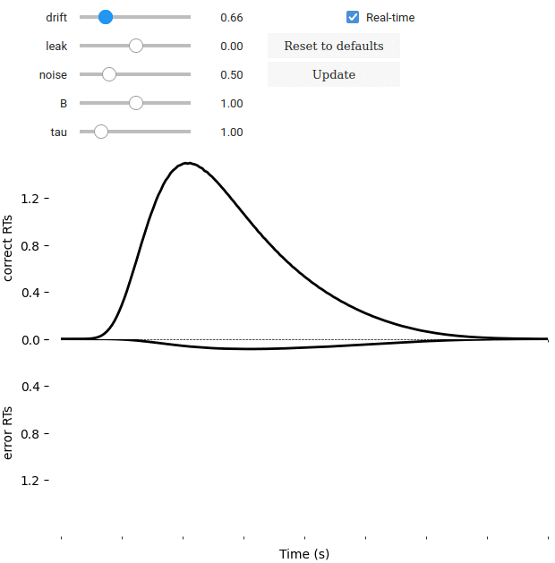

Model GUI
=========

PyDDM additionally features a GUI which allows you to manually tweak
the parameters and instantaneously see the change in the model.  This
is useful for learning about the DDM, for gaining an intuition on new
models, and for testing new models before fitting them.

.. image:: images/model-gui-animation.gif

The radio buttons on the left may be used to show the conditional fit
of the model on only specific task parameters.  The sliders on the
right may be used to control the parameter fit values.  The function
to plot may also be customized; see :func:`.plot.model_gui` for more
details.

There are two versions, one for Jupyter notebooks
(:func:`.plot.model_gui_jupyter`) and one for a native interface
(:func:`.plot.model_gui`).  Both have the same features and can be used
interchangably based on your preference.

`Try it out on Google Colab!
<https://colab.research.google.com/github/mwshinn/PyDDM/blob/master/doc/notebooks/interactive_demo.ipynb>`_

:ref:`help_model_gui`

Additional views
----------------

The default view for the model GUI is :func:`.plot.plot_fit_diagnostics`, which
shows the response time distribution.  However, other options are available,
including:

Psychometric function
~~~~~~~~~~~~~~~~~~~~~

The psychometric function can be viewed by generating a view function with the
function :func:`.plot.plot_psychometric`.  The psychometric is constructed with
some condition on the x axis, and the probability of a correct response on
the y axis.  For instance, for the condition "coh"::

    pyddm.plot.model_gui_jupyter(m, sample=samp, plot=pyddm.plot.plot_psychometric('coh'))

You can also split this by some other condition, for instance, a high or low
attention condition named "attn"::

    pyddm.plot.model_gui_jupyter(m, sample=samp, plot=pyddm.plot.plot_psychometric('coh', split_by_condition='attn'))

In addition, this GUI is also compatible with Jupyter notebooks.

Chronometric function
~~~~~~~~~~~~~~~~~~~~~

The chronometric function can be viewed by generating a view function with the
function :func:`.plot.plot_chronometric`.  It operates the same way as the
psychometric function.

Bound shape
~~~~~~~~~~~

For complicated forms of collapsing bounds, it can be useful to view the shape
of the bound as it changes with different parameters.  This can be accomplished
in the model GUI using::

    pyddm.plot.model_gui_jupyter(m, plot=pyddm.plot.plot_bound_shape)
