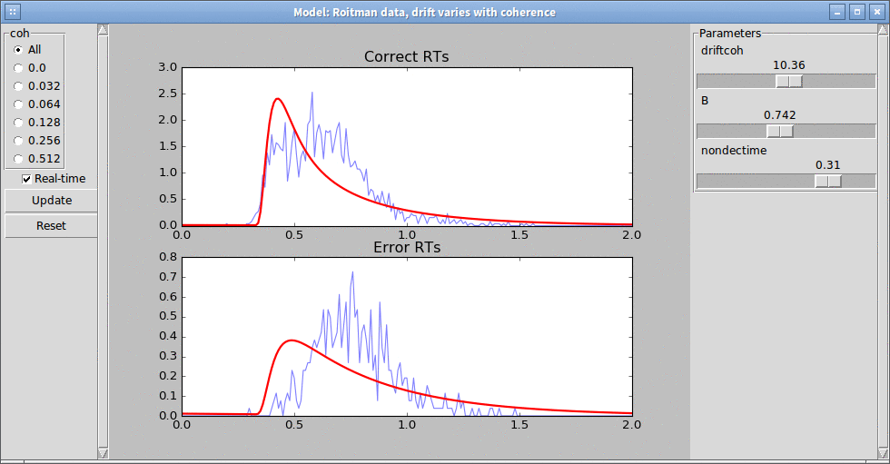
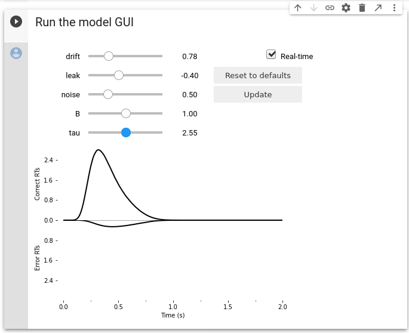

Model GUI
=========

PyDDM additionally features a GUI which allows you to manually tweak
the parameters and instantaneously see the change in the model.  This
is useful for learning about the DDM, for gaining an intuition on new
models, and for testing new models before fitting them.

The radio buttons on the left may be used to show the conditional fit
of the model on only specific task parameters.  The sliders on the
right may be used to control the parameter fit values.  The function
to plot may also be customized; see :func:`.plot.model_gui` for more
details.

Jupyter notebook GUI
--------------------

In addition, this GUI is also compatible with Jupyter notebooks.

`Try it out on Google Colab!
<https://colab.research.google.com/github/mwshinn/PyDDM/blob/master/doc/notebooks/pyddm_demo_leaky_collapse.ipynb>`_
