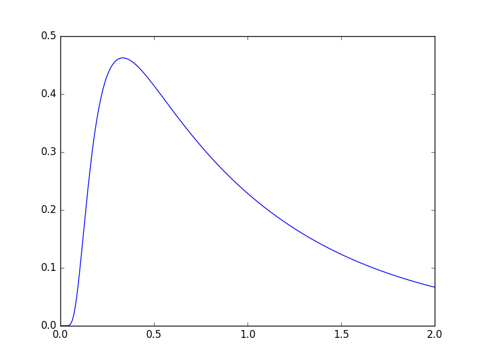
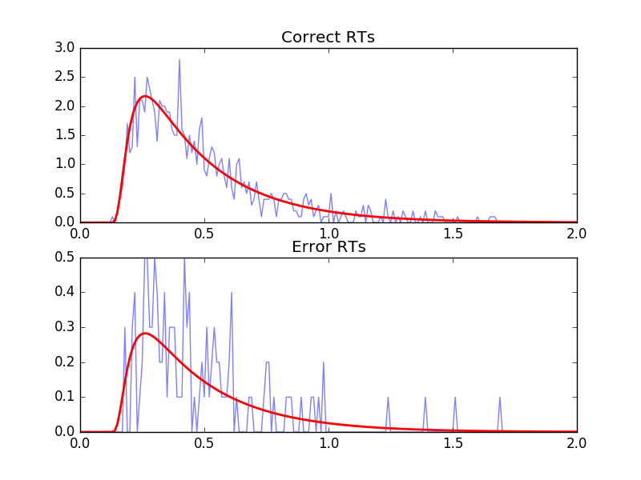
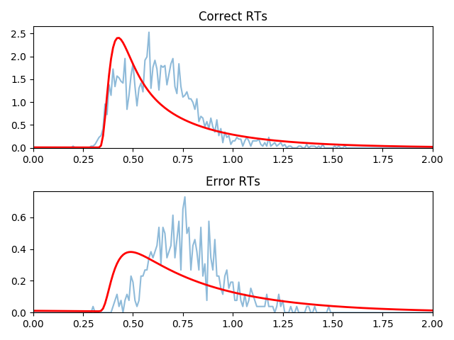
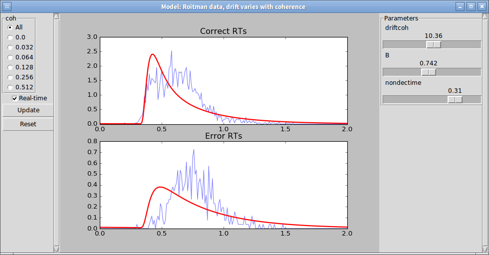
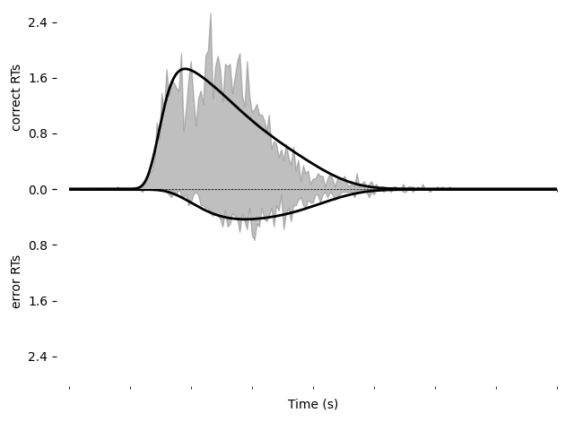

Quick Start guide
=================

Hello, world!
-------------

To get started, let's simulate a basic model and plot it.  For
simplicity, we will use all of the model defaults.

.. literalinclude:: downloads/helloworld.py
   :language: python

Congratulations!  You've successfully simulated your first model!
Let's dig in a bit so that we can define more useful models.

:download:`Download this full example <downloads/helloworld.py>`

Simple example
--------------

The following simulates a simple DDM with constant drift.  First, it
shows how to build a model and then uses it to generate artificial
data.  After the artificial data has been generated, it fits a new
model to these data and shows that the parameters are similar.

:class:`.Model` is the object which represents a DDM.  Its default
behavior can be changed through :class:`.Drift`, :class:`.Noise`,
:class:`.Bound`, :class:`.InitialCondition`, and :class:`.Overlay`
objects, which specify the behavior of each of these model components.
Each model must have one of each of these, but defaults to a simple
case for each.  These determine how it calculates the drift rate
(:class:`.Drift`), diffusion coefficient (:class:`.Noise`), shape of the
integration boundaries (:class:`.Bound`), initial particle
distribution (:class:`.InitialCondition`), and any other modifications
to the generated solution (:class:`.Overlay`).

Each of these model components may take "parameters" which are
(usually) unique to that specific model component.  For instance, the
:class:`.DriftConstant` class takes the "drift" parameter, which
should be passed to the constructor.  Similarly,
:class:`.NoiseConstant` takes the parameter "noise" to determine the
standard deviation of the drift process, and
:class:`.OverlayNonDecision` takes "nondectime", the non-decision time
(efferent/afferent/apparatus delay) in seconds.  Some model
components, such as :class:`.ICPointSourceCenter` which represents a
starting point initial condition directly in between the bounds, does
not take any parameters.

For example, the following is a DDM with drift 2.2, noise 1.5, bound
1.1, and a 100ms non-decision time.  It is simulated for 2 seconds
(``T_dur``) with reasonable timestep and grid size (``dt`` and
``dx``).  Once we define the model, the :meth:`~.Model.solve` function
runs the simulation.  This model can be described as shown below:

.. literalinclude:: downloads/simple.py
   :language: python
   :lines: 4-13, 17-18

Solution objects represent correct and erred probability distribution 
functions over time. We can generate psuedo-data from this solved 
model with the :meth:`~.Solution.resample` function:

.. literalinclude:: downloads/simple.py
   :language: python
   :lines: 22
  
To fit the outputs, we first create a model with special
:class:`.Fittable` objects in all the parameters we would like to
fit.  We specify the range of each of these objects as a hint to the
optimizer; this is mandatory for some but not all optimization
methods.  Then, we run the :func:`.fit_adjust_model` function, which
will convert the :class:`.Fittable` objects to :class:`.Fitted`
objects and find a value for each which collectively minimizes the
objective function.

Here, we use the same model as above, since we know the form the model
is supposed to have.  We fit the model to the generated data using BIC
as a loss function and differential evolution to optimize the
parameters:

.. literalinclude:: downloads/simple.py
   :language: python
   :lines: 26-38

We can display the newly-fit parameters with the
:func:`~.functions.display_model` function:

.. literalinclude:: downloads/simple.py
   :language: python
   :lines: 40

This shows that the fitted value of drift is 2.2096, which is close to
the value of 2.2 we used to simulate it.  Similarly, noise fits to
1.539 (compared to 1.5) and nondectime (non-decision time) to 0.1193
(compared to 0.1).  The fitting algorithm is stochastic, so exact
values may vary slightly::

  Model Simple model (fitted) information:
  Drift component DriftConstant:
      constant
      Fitted parameters:
      - drift: 2.209644
  Noise component NoiseConstant:
      constant
      Fitted parameters:
      - noise: 1.538976
  Bound component BoundConstant:
      constant
      Fixed parameters:
      - B: 1.100000
  IC component ICPointSourceCenter:
      point_source_center
      (No parameters)
  Overlay component OverlayNonDecision:
      Add a non-decision by shifting the histogram
      Fitted parameters:
      - nondectime: 0.119300

While the values are close to the true values, the fit is not perfect
due to the finite size of the resampled data. We can also draw a plot
visualizing the fit.  Unlike our first example, we will now use one of
PyDDM's convenience methods, :func:`~.plot.plot_fit_diagnostics`:

.. literalinclude:: downloads/simple.py
   :language: python
   :lines: 43-47

Using the :class:`.Solution` object ``sol`` we have access to a number
of other useful functions.  For instance, we can display the
probability of a correct response using
:meth:`~.Solution.prob_correct` or the entire histogram of errors
using :meth:`~.Solution.pdf_err`.

.. literalinclude:: downloads/simple.py
   :language: python
   :lines: 49-50

See :class:`the Solution object documentation <.Solution>` for more
such functions.

:download:`Download this full example <downloads/simple.py>`
           
Working with data
-----------------

(`View a shortened interactive version of this tutorial. <https://colab.research.google.com/github/mwshinn/PyDDM/blob/master/doc/notebooks/pyddm_gddm_short_tutorial.ipynb>`_)

Loading data from a CSV file
~~~~~~~~~~~~~~~~~~~~~~~~~~~~

In this example, we load data from the open dataset by Roitman and
Shadlen (2002).  This dataset can be `downloaded here
<https://shadlenlab.columbia.edu/resources/RoitmanDataCode.html>`_ and
the relevant data extracted :download:`with our script
<downloads/extract_roitman.py>`.  The processed CSV file can be
:download:`downloaded directly <downloads/roitman_rts.csv>`.

The CSV file generated from this looks like the following:

====== ===== ===== ======= =========
monkey rt    coh   correct trgchoice
====== ===== ===== ======= =========
1      0.355 0.512 1.0     2.0
1      0.359 0.256 1.0     1.0
1      0.525 0.128 1.0     1.0
====== ===== ===== ======= =========

It is fairly easy then to load and process the CSV file:

.. literalinclude:: downloads/roitman_shadlen.py
   :language: python
   :lines: 6-23

This gives an output sample with the conditions "monkey", "coh", and
"trgchoice".

Note that this examples requires `pandas
<https://pandas.pydata.org/>`_ to be installed.

Loading data from a numpy array
~~~~~~~~~~~~~~~~~~~~~~~~~~~~~~~

Data can also be loaded from a numpy array.  For example, let's load
the above data without first loading it into pandas:

.. literalinclude:: downloads/roitman_shadlen.py
   :language: python
   :lines: 28-50

We can confirm that these two methods of loading data produce the same results:

.. literalinclude:: downloads/roitman_shadlen.py
   :language: python
   :lines: 53

Fitting a model to data
~~~~~~~~~~~~~~~~~~~~~~~

Now that we have loaded these data, we can fit a model to them.  First
we will fit a DDM, and then we will fit a GDDM.

First, we want to let the drift rate vary with the coherence.  To do
so, we must subclass :class:`.Drift`.  Each subclass must contain a name
(a short description of how drift varies), required parameters (a list of
the parameters that must be passed when we initialize our subclass,
i.e. parameters which are passed to the constructor), and required
conditions (a list of conditions that must be present in any data when
we fit data to the model).  We can easily define a model that fits our
needs:

.. literalinclude:: downloads/roitman_shadlen.py
   :language: python
   :lines: 58-66

Because we are fitting with likelihood, we must include a baseline
lapse rate to avoid taking the log of 0.  Traditionally this is
implemented with a uniform distribution, but PyDDM can also use an
exponential distribution using
:class:`~.models.overlay.OverlayPoissonMixture` (representing a
Poisson process lapse rate), as we use here.  However, since we also
want a non-decision time, we need to use two Overlay objects.  To
accomplish this, we can use an :class:`~.models.overlay.OverlayChain`
object.  Then, we can construct a model which uses this and fit the
data to the model:

.. literalinclude:: downloads/roitman_shadlen.py
   :language: python
   :lines: 70-90

Finally, we can display the fit parameters with the following command:

.. literalinclude:: downloads/roitman_shadlen.py
   :language: python
   :lines: 91

This gives the following output (which may vary slightly, since the
fitting algorithm is stochastic)::

  Model Roitman data, drift varies with coherence information:
  Drift component DriftCoherence:
      Drift depends linearly on coherence
      Fitted parameters:
      - driftcoh: 10.388292
  Noise component NoiseConstant:
      constant
      Fixed parameters:
      - noise: 1.000000
  Bound component BoundConstant:
      constant
      Fitted parameters:
      - B: 0.744209
  IC component ICPointSourceCenter:
      point_source_center
      (No parameters)
  Overlay component OverlayChain:
      Overlay component OverlayNonDecision:
          Add a non-decision by shifting the histogram
          Fitted parameters:
          - nondectime: 0.312433
      Overlay component OverlayPoissonMixture:
          Poisson distribution mixture model (lapse rate)
          Fixed parameters:
          - pmixturecoef: 0.020000
          - rate: 1.000000
  Fit information:
      Loss function: Negative log likelihood
      Loss function value: 199.3406727870083
      Fitting method: differential_evolution
      Solver: auto
      Other properties:
          - nparams: 3
          - samplesize: 2611
          - mess: ''

Note that if you see "Warning: renormalizing model solution from X to
1." for some X, this is okay as long as X is close ($<10^{-5}$ or so)
to 1.0 or as long as this is seen early in the fitting procedure.  If
it is larger or seen towards the end of the fitting procedure,
consider using smaller dx or dt in the simulation.  This indicates
numerical imprecision in the simulation.
         
Plotting the fit
~~~~~~~~~~~~~~~~

We can also graphically evaluate the quality of the fit.  We can plot
and save a graph:

.. literalinclude:: downloads/roitman_shadlen.py
   :language: python
   :lines: 95-99

This model does not seem to fit the data very well.

We can alternatively explore this with the PyDDM's model GUI:

.. literalinclude:: downloads/roitman_shadlen.py
   :language: python
   :lines: 104

See :doc:`modelgui` for more info.

:download:`Download this full example <downloads/roitman_shadlen.py>`

Improving the fit
-----------------

Let's see if we can improve the fit by including additional model
components.  We will include exponentially collapsing bounds and use a
leaky or unstable integrator instead of a perfect integrator.

To use a coherence-dependent leaky or unstable integrator, we can
build a drift model which incorporates the position of the decision
variable to either increase or decrease drift rate.  This can be
accomplished by making ``get_drift`` depend on the argument ``x``.

.. literalinclude:: downloads/roitman_shadlen.py
   :language: python
   :lines: 110-117

Collapsing bounds are already included in PyDDM, and can be accessed
with :class:`~.models.bound.BoundCollapsingExponential`.

Thus, the full model definition is

.. literalinclude:: downloads/roitman_shadlen.py
   :language: python
   :lines: 120-136

Before fitting this model, let's look at it in the model GUI::

  from ddm.plot import model_gui
  model_gui(model_leak, sample=roitman_sample)
           
We can fit this and save it as an image using the following.  Note
that this may take a while (hours) due to the increased number of
parameters and because the earlier examples were able to use the
analytical solver but the present example must use backward Euler.
For all coherences, the fit is:

.. literalinclude:: downloads/roitman_shadlen.py
   :language: python
   :lines: 140-142

Going further
-------------

Just as we created DriftCoherence above (by inheriting from :class:`.Drift`)
to modify the drift rate based on coherence, we can modify other
portions of the model.  See :doc:`cookbook/index` for more examples.  Also
see the :doc:`apidoc/index` for more specific details about overloading
classes.

Summary
-------

PyDDM can simulate models and generate artificial data, or it can fit
them to data.  Below are high-level overviews for how to accomplish
each.

To simulate models and generate artificial data:

1. Optionally, define unique components of your model. Models are
   modular, and allow specifying a dynamic drift rate, noise level,
   diffusion bounds, starting position of the integrator, or
   post-simulation modifications to the RT histogram.  Many common
   models for these are included by default, but for advance
   functionality you may need to subclass :class:`.Drift`,
   :class:`.Noise`, :class:`.Bound`, :class:`.InitialCondition`, or
   :class:`.Overlay`.  These model components may depend on
   "conditions", i.e. prespecified values associated with the
   behavioral task which change from trial to trial (e.g. stimulus
   coherence), or "parameters", i.e. values which apply to all trials
   and should be fit to the subject.
2. Define a model.  Models are represented by creating an instance of
   the :class:`.Model` class, and specifying the model components to
   use for it.  These model component can either be :doc:`the model
   components included in PyDDM <apidoc/dependences>` or ones you created in
   step 1.  Values must be specified for all parameters required by
   model components.
3. Simulate the model using the :meth:`.Model.solve()` method to
   generate a :class:`.Solution` object.  If you have multiple
   conditions, you must run :meth:`.Model.solve()` separately for
   each set of conditions and generate separate :class:`.Solution`
   objects.
4. Run the :meth:`.Solution.resample()` method of the
   :class:`.Solution` object to generate a :class:`.Sample`.  If you
   have multiple :class:`.Solution` objects (for multiple task
   conditions), you will need to generate multiple :class:`.Sample`
   objects as well.  These can be added together with the "+" operator
   to form one single :class:`.Sample` object.

To fit a model to data:

1. Optionally define unique components of your model, as mentioned in
   Step 1 above.
2. Load your data into a :class:`.Sample` object using either
   :meth:`.Sample.from_numpy_array` or :meth:`.Sample.from_pandas_dataframe`.  If you
   have multiple task conditions (i.e. prespecified values associated
   with the behavioral task which change from trial to trial), make
   sure that the names of the conditions in the :class:`.Sample` object align
   with those that are used in your model components.  (In other
   words, if a model component expects a coherence value named "coh",
   make sure your sample includes a coherence value named "coh".)
3. Define a model.  Models are represented by creating an instance of
   the :class:`.Model` class, and specifying the model components to
   use for it.  These model component can either be :doc:`the model
   components included in PyDDM <apidoc/dependences>` or ones you created in
   step 1.  Parameters for the model components must either be
   specified expicitly or else set to a :class:`.Fittable` instance,
   for example "Fittable(minval=0, maxval=1)".
3. Run :func:`.fit_adjust_model` on the model and the sample.  Optionally
   specify a :class:`loss function <.LossFunction>` other than the default
   (which uses BIC).  After fitting, the :class:`.Fittable` objects in
   the model will be changed to :class:`.Fitted` objects, which are
   just like :class:`.Fittable` objects except they contain the fitted
   values.
4. View the output by calling :func:`.display_model` on the model.
   The value of the loss function is accessible via
   :meth:`.Model.get_fit_result`.
           
